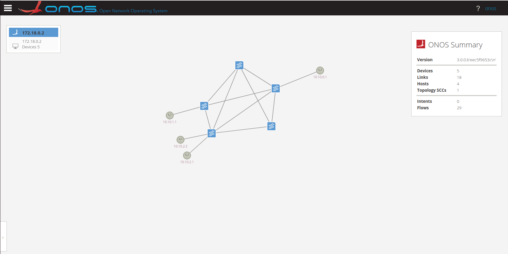
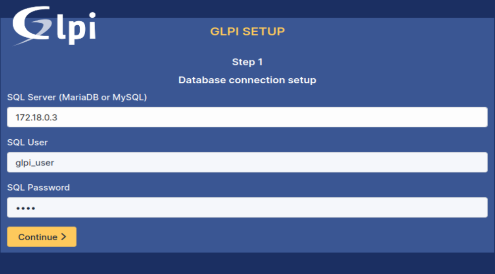

#### 🌐 Project Context
With the growing need for flexibility, automation, and network monitoring, traditional architectures are reaching their limits. Software Defined Networking (SDN), by separating traffic control from its forwarding, offers a more dynamic approach. This project proposes the implementation of an SDN infrastructure controlled by ONOS, deployed using Kubeadm (Kubernetes), and monitored with GLPI.
#### How can we implement a modern, automated, and monitorable network infrastructure by combining SDN, Kubernetes, and GLPI technologies to overcome the limitations of classical architectures?

# Projet-M207
SDN infrastructure with ONOS, Kubernetes cluster via kubeadm, and GLPI monitoring. Deployment of HTTPS, MySQL, and Samba services in Kubernetes, with dynamic network management and inventory via FusionInventory.

## 🧪 Lab Topology


## 🛠 Step 1: Prepare Your Lab Environment

### 🖥 Virtual Machines

•Use your preferred virtualization platform (VirtualBox, VMware, KVM, etc.)

•Create three Ubuntu VMs

•Name them exactly as follows:

  --> `SDN`    GUI (Graphical User Interface) / IP Address : 192.168.3.134

  --> `Master` CLI (Command Line Interface)   / IP Address : 192.168.3.129

  --> `Worker` CLI (Command Line Interface)   / IP Address : 192.168.3.131

• Make sure all three VMs are on the same network so they can communicate. Exemple: `NAT`

• *you should be `root`*

## 🐳 Step 2: Install Docker & Pull Required Images

On `SDN` VM:

2• Install docker:

https://docs.docker.com/engine/install/ubuntu/#install-using-the-repository

3• Install [Contairnet decker image](https://hub.docker.com/r/containernet/containernet), from docker hub:

```bash
docker pull containernet/containernet
```

4• Install [ONOS docker image](https://hub.docker.com/r/onosproject/onos), from docker hub:

```bash
docker pull onosproject/onos
```

After cloning the repository with `git clone`, navigate into the project directory:

```bash
cd Projet-M207
```

5• Create a Docker ubuntu gateway to allow access to the internet and other networks:

We need to creat first `dockerfile`

```basj
apt install nano
nano Dockerfile
```

copy this inside:

```bash
FROM ubuntu:xenial

RUN apt-get update && apt-get install -y \
    iproute2 \
    net-tools \
    iputils-ping \
    iptables \
    dnsutils \
    curl \
    tcpdump \
    vim \
    python && \
    apt-get clean
```

Then we will build it

```bash
docker build -t gateway .
```

## 🚀 Step 3: Deploy the Infrastructure
After the images are pulled and the build process is complete, you can launch your emulated data-plane and ONOS controller.

After that, execute the docker composition with:

```bash
docker compose up -d
```
`-d` tells Docker to run containers in the background.

"open a new terminal"

After a while, both images will be up and running. Log into the Containernet container by executing:

```bash
docker exec -it containernet bash
```

Inside the container, to run the intended topology, execute the following commands:
```bash
mn -c;
curl -O https://raw.githubusercontent.com/Faical-Ach/Projet-M207/main/topo.py;
python topo.py;
```

## 🧠 Step 4: Configure ONOS Controller

"open a new terminal"

Connect to the ONOS controller by executing:

```bash
docker exec -it onos bash
```

execute the Onos Command Line Interface (CLI) or client console by executing:

```bash
./apache-karaf-4.2.14/bin/client
```

Make sure the output contains the Onos GUI. Now, you can go to your Onos GUI using your browser and going to the address localhost:8181/onos/ui/. The default `username / password` is `onos/rocks`. Check the GUI and explore the main menu (bars at the left upper corner).

Go to the main menu -> Applications. Enable the following applications (select and hit the play button near the upper right corner):

• OpenFlow Base Provider (org.onosproject.openflow-base)

• Proxy ARP/NDP (org.onosproject.proxyarp), just to avoid taking care of ARP ourselves :)

• LLDP Link Provider (org.onosproject.lldpprovider)

• Host Location Provider (org.onosproject.hostprovider)



Indeed, you could have enabled all these applications via the Onos console. Go to your containernet console and execute the command:
```bash
containernet> pingall
```
You should still see no connectivity, but, do not worry, we did that just to make sure our controller recognizes fully our data-plane. Go to the main menu -> Topology, you should be able to see the correct topology (if you do not see the hosts toggle the host visibility by typing `h` on the GUI or enabling on the display options panel at the left lower corner).

Activate ONOS `forwarding` and `ACL` apps inside Onos console:

```bash
onos > app activate org.onosproject.fwd
onos > app activate org.onosproject.acl
```


## 🔒 Step 5: ONOS ACL Rules (SDN VM)
*On Vm Ubuntu SDN*

Let's do :

• h1 = user1

• h2 = user2

• h3 = user3

1• Allow Internal Traffic (10.10.0.0/16)

```bash
curl -u onos:rocks -X POST -H "Content-Type: application/json" -d '{
  "srcIp": "10.10.0.0/16",
  "dstIp": "10.10.0.0/16",
  "action": "ALLOW"
}' http://localhost:8181/onos/v1/acl/rules
```
2• Allow access to your local network

```bash
curl -u onos:rocks -X POST -H "Content-Type: application/json" -d '{
  "srcIp": "10.10.0.0/16",
  "dstIp": "192.168.0.0/16",
  "action": "ALLOW"
}' http://localhost:8181/onos/v1/acl/rules
```

3• Deny access to internet

```bash
curl -u onos:rocks -X POST -H "Content-Type: application/json" -d '{
  "srcIp": "10.10.0.0/16",
  "action": "DENY"
}' http://localhost:8181/onos/v1/acl/rules
```

## ☸ Step 6: Kubernetes Cluster Setup

Folow this configuration step by step:

### For both master and worker nodes:
```bash
# Disable swap
sudo swapoff -a
# Permanently disable swap by commenting out swap entries in /etc/fstab

# Load necessary kernel modules
sudo modprobe overlay
sudo modprobe br_netfilter

# Set sysctl params required by Kubernetes
cat <<EOF | sudo tee /etc/sysctl.d/k8s.conf
net.bridge.bridge-nf-call-iptables  = 1
net.ipv4.ip_forward                 = 1
net.bridge.bridge-nf-call-ip6tables = 1
EOF

sudo sysctl --system

# Install container runtime (Docker example)
sudo apt update
sudo apt install -y docker.io
sudo systemctl enable --now docker

# Add Kubernetes apt repo
sudo apt update && sudo apt install -y apt-transport-https curl
curl -s https://packages.cloud.google.com/apt/doc/apt-key.gpg | sudo apt-key add -

cat <<EOF | sudo tee /etc/apt/sources.list.d/kubernetes.list
deb https://apt.kubernetes.io/ kubernetes-xenial main
EOF

sudo apt update

# Install kubeadm, kubelet, kubectl
sudo apt install -y kubelet kubeadm kubectl
sudo apt-mark hold kubelet kubeadm kubectl

# Enable kubelet service
sudo systemctl enable --now kubelet
```

### Initialize Master Node (on Master only):

```bash
sudo kubeadm init --pod-network-cidr=192.168.0.0/16
```

After initialization, copy the kubeconfig file to use kubectl:

```bash
mkdir -p $HOME/.kube
sudo cp -i /etc/kubernetes/admin.conf $HOME/.kube/config
sudo chown $(id -u):$(id -g) $HOME/.kube/config
```

Install Pod Network:

```bash
kubectl apply -f https://raw.githubusercontent.com/coreos/flannel/master/Documentation/kube-flannel.yml
```
Do not run this on Worker Nodes — Master Node only

### Join Worker Node:

After excute master node should be give you this:
```bash
kubeadm join <master-ip>:6443 --token <token> --discovery-token-ca-cert-hash sha256:<hash>
```

Then, Verify Cluster (on Master):
```bash
kubectl get nodes
```

You should be see :
```bash
root@master:~$ kubectl get nodes
NAME     STATUS   ROLES           AGE   VERSION
master   Ready    control-plane   18m   v1.28.15
worker    Ready    <none>          40h   v1.28.15
```

## 📡 Step 6: Deploy Services (HTTP, MySQL, Samba)

On `Vm Master` node:

1• HTTP:

```bash
nano web-server.yml
```

Set this confige: 
```bash
  selector:
    matchLabels:
      app: web
  template:
    metadata:
      labels:
        app: web
    spec:
      containers:
      - name: nginx
        image: nginx
        ports:
        - containerPort: 80
---
apiVersion: v1
kind: Service
metadata:
  name: web-service
spec:
  selector:
    app: web
  ports:
  - port: 80
    targetPort: 80
  type: NodePort

```
2• MYSQL:

```bash
nano mysql.yml
```

Then:
```bash
      labels:
        app: mysql
    spec:
      containers:
      - name: mysql
        image: mysql:5.7
        env:
        - name: MYSQL_ROOT_PASSWORD
          value: rootpass
        ports:
        - containerPort: 3306
---
apiVersion: v1
kind: Service
metadata:
  name: mysql-service
spec:
  type: NodePort
  selector:
    app: mysql
  ports:
  - name: mysql
    port: 3306
    targetPort: 3306
    nodePort: 31306


```

3• SAMBA:

```bash
nano samba.yml
```

Then:
```bash
  containers:
  - name: samba
    image: dperson/samba
    args: ["-s", "public;/mount;yes;no;no;all;none"]
    ports:
    - containerPort: 139
    - containerPort: 445
---
apiVersion: v1
kind: Service
metadata:
  name: samba-service
spec:
  type: NodePort
  selector:
    name: samba
  ports:
  - name: smb139
    port: 139
    targetPort: 139
    nodePort: 31390
  - name: smb445
    port: 445
    targetPort: 445
    nodePort: 31445
```
To run pods:

```bash
kubectl apply -f web-server.yml
```

```bash
kubectl apply -f samba.yml
```

```bash
kubectl apply -f mysql.yml
```

chek pods with

```bash
kubectl get pods
```
You should be see:

```bash
root@master:/home/sr2# kubectl get pods
NAME                              READY   STATUS              RESTARTS   AGE
mysql-697d9876f6-hjh6r            1/1     Running             0          2d1h
samba                             1/1     Running             0          2d1h
web-deployment-9d7df9d66-q2rzq    1/1     Running             0          2d1h
```
If you have problem with run pods try:

```bash
kubectl describe pod <pod-name>
```

## 🛢️ Step 7: Configure MySQL Databases

On `Vm SDN` :

Create DB1 and DB2

### connect to mysql:

`password = rootpass`

```bash
mysql -h <worker-ip> -P <service-port> -u root -p
```

### Create Databases:

```bash
mysql> CREATE DATABASE DB1;
mysql> CREATE DATABASE DB2;
```

### Create users:

```bash
mysql> CREATE USER 'user1'@'%' IDENTIFIED BY 'P@ssw0rd';
mysql> CREATE USER 'user2'@'%' IDENTIFIED BY 'P@ssw0rd';
mysql> CREATE USER 'user3'@'%' IDENTIFIED BY 'P@ssw0rd';
```

### Grant User Permissions:

```bash
mysql> GRANT ALL PRIVILEGES ON DB1.* TO 'user1'@'%';
mysql> GRANT ALL PRIVILEGES ON DB2.* TO 'user2'@'%';
mysql> GRANT ALL PRIVILEGES ON DB2.* TO 'user3'@'%';
```

### Apply Permission Changes:

```bash
mysql> FLUSH PRIVILEGES;
```

## 🤖 Step 8: Deploy and Configure the GLPI Virtual Assistant

Switch to the SDN virtual machine.

Then follow these steps:

```bash
cd Projet-M207/glpi
```

Start the GLPI container using Docker Compose:

```bash
docker compose up -d
```

The `-d` flag runs the containers in detached mode (in the background).

To verify that the GLPI container is running, use:

```bash
docker ps
```

Once the container is running, open your browser and navigate to:

[http://localhost:80](http://localhost:80)

Follow the steps in the browser:

### Database Config :


To find SQL server:

```bash
docker network inspect glpi_default
```

Credentials:

• Username: `glpi_user`

• Password: `glpi`


### Setup :


Then :

### Confirmation


finally Your glpi work :

### GLPI Ready :


## ✅ setp 9: Vérification des services depuis les hôtes SDN 

You should get ports services with:

```bash
root@master:/home/sr2# kubectl get svc
NAME            TYPE        CLUSTER-IP       EXTERNAL-IP   PORT(S)                       AGE
kubernetes      ClusterIP   10.96.0.1        <none>        443/TCP                       12d
mysql-service   NodePort    10.105.211.29    <none>        3306:31306/TCP                12d
samba-service   NodePort    10.109.197.207   <none>        139:31390/TCP,445:31445/TCP   12d
web-service     NodePort    10.100.203.173   <none>        80:32304/TCP                  12d
```

Enter To Host in containernet exemple `h1`

```bash
containernet> h1 bash
```

you will see :

```bash
root@h1:/#
```

### 📡 1. Tester l'accès HTTP

```bash
root@h1:/# nc -zv <Worker_IP> <NodePort_HTTP>
```

If http work you should see this :

```bash
root@h1:/# nc -zv 192.168.3.131 32304
Connection to 192.168.3.131 32304 port [tcp/*] succeeded!
```

### 🛢️ 2. Test MySQL Access from Hosts
Run the following command from each host (e.g., h1, h2, h3) to test MySQL connectivity:

```bash
mysql -h <worker_IP> -P <NodePort_MySQL> -u <username> -p
```
🔐 Password: `P@ssw0rd`


🧪 Expected Results:

• 🖥️ From `h1`, you should see only `DB1`:

```bash
mysql> SHOW DATABASES;
+--------------------+
| Database           |
+--------------------+
| information_schema |
| DB1                |
+--------------------+
```

• 🖥️ From `h2` and `h3`, you should see only `DB2`:

```bash
mysql> SHOW DATABASES;
+--------------------+
| Database           |
+--------------------+
| information_schema |
| DB2                |
+--------------------+
```

